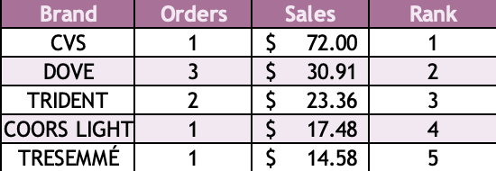
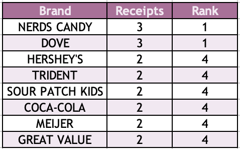
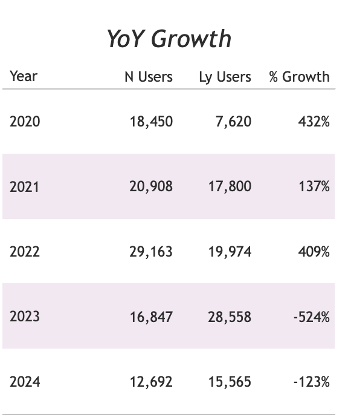
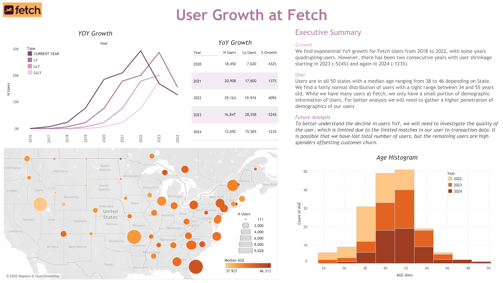

# Fetch Case Study | *Candice Sessa-Filar*

Purpose review Fetch data showcasing ability for:
- Data Cleaning
- Data Analysis
- Ability to utilize multiple technical suite
- Communication

## Deliverable Part 1 | Data Analysis
- Identify top 5 brands by sales among users that have had their account for at least six months

- Identify the top 5 brands by receipts scanned among users 21 and over

- What percent has Fetch grown year over year?
  - For full analysis please review Data Viz

## Deliverable Part 2 | Data Email
Hi Fetch Data Leader!

As I was preparing this analysis I came across two unusual findings that I believe are related to data quality:
  
  1) We have a lot of data users in our database, but few users with a matching transaction (<10%)
     - This means we are unable to pull in any customer information to our transactions history limiting any key customer insights.
  3) When analyzing the trend of our total users YoY, we have seen large declines in user growth since 2022.
     - Does this match your business knowledge? I am wondering if we have a data feed issue or if we are experiencing large churn in customers since 2022

I would like to investigate if we are experiencing a data feed issue in our user to transaction data - **do you know who would be the best person for me to reach out to?**

As for 2) if this matches your business knowledge, I would like to investigate if the spend of our customers has remained constant (i.e. did we lose total customers but the customers left spend more offsetting churn)?

Let me know if you want to jump on a call to discuss further!

Candice

# Project Components
### Data Prep

The data is prepared using [Google Bigquery SQL server](https://console.cloud.google.com/bigquery?_gl=1*jn7tsk*_up*MQ..&gclid=Cj0KCQiA4-y8BhC3ARIsAHmjC_EE14TGQbo-E56maD4ynLhGnPWKppRGaeeMUQg4dJahCBG7n2z2NG4aAqMDEALw_wcB&gclsrc=aw.ds&project=zeta-matrix-337222) (GBQ.)

The repo is broken up into 3 folders:
* Code
  * SQL code used for data preparation (code file is heavily annotated with assumptions + process)
* Images
  * Fetch Logo used for Readme + Tableau
* Data
  * 3 sources provided from Fetch
  * 2 exports used for Tableau Public
  * 1 source is provided in GBQ server (State Codes>Lat/Lon)

Note: we found very few matches between Transaction data & User data resulting in small sample sets for Questions 1 + 2, analysis would benefit from having additional data points

### Data Viz

[Visualizations prepared using Tableau Public](https://public.tableau.com/views/FetchUserCaseStudy/Dashboard1?:language=en-US&:sid=&:redirect=auth&:display_count=n&:origin=viz_share_link). Typically, we would link GBQ directly to Tableau but this feature is only available in Tableau Desktop, so we export the two data tables from GBQ then manually upload to Tableau

 

